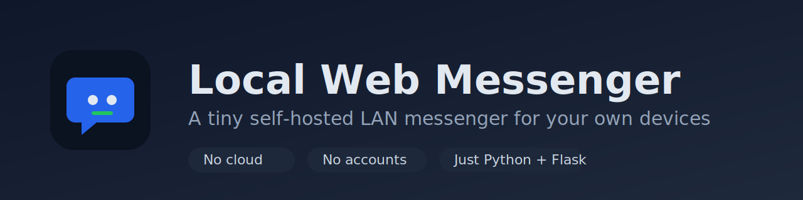
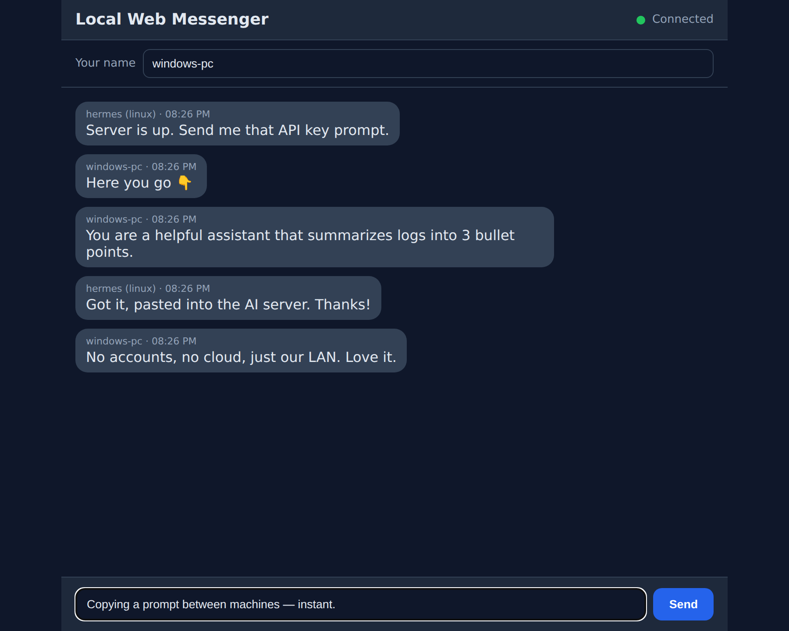

<!-- Banner: docs/assets/banner.svg (export to PNG for the GitHub social preview) -->
<p align="center">
  
</p>

<h1 align="center">Local Web Messenger</h1>

<p align="center">
  <strong>A tiny self-hosted LAN messenger for chatting and sharing text between devices on the same network or Tailscale.</strong>
</p>

<p align="center">
  <a href="#-quick-start">Quick start</a> ·
  <a href="#-installation">Install</a> ·
  <a href="#-why-this-exists">Why</a> ·
  <a href="#-faq">FAQ</a> ·
  <a href="START_HERE.md">Beginner guide</a>
</p>

<p align="center">
  
  
  
  
</p>

---

Open a web page on your phone, laptop, or any computer on your network and you
are instantly in the same chat — no app store, no sign-up, no internet. The chat
lives on **one machine you own** (a home server, a Raspberry Pi, a mini PC) and
everything stays on your network.

<!--
  Replace the screenshot below with an animated demo for maximum effect:
  
  See docs/assets/README.md for how to record one.
-->
<p align="center">
  
</p>

## ✨ Key features

- 💬 **Real-time-ish chat** in any web browser (updates every second).
- 🏠 **Self-hosted & local-first** — no cloud, no accounts, no tracking.
- 🪶 **Tiny & readable** — one `app.py`, plain HTML/CSS/JS, SQLite. No build step.
- 🌐 **Works over LAN or Tailscale** — reachable from any device that can see the host.
- 🔌 **One-command launch** — `bash start.sh` on Linux, or double-click on Windows.
- 💾 **Keeps history** in a local SQLite file you control.
- 📋 **Great for copy-paste between machines** — links, commands, AI prompts.

> **Honest scope:** there is no login, no encryption, and it uses Flask's
> development server. It is built for a **trusted** home network or private
> Tailscale, not the public internet. See [Why this exists](#-why-this-exists).

## 🚀 Quick start

On the machine that will host the chat (Linux):

```bash
git clone https://github.com/techcamper19/local-web-messenger.git
cd local-web-messenger
bash start.sh
```

It prints an address like `http://192.168.1.50:8080`. Open that on any device on
your network and start chatting. To stop: press `Ctrl + C`.

New to this? The **[START_HERE.md](START_HERE.md)** guide walks through it step
by step, with Windows instructions and troubleshooting.

## 📦 Installation

You need **Python 3.8+**. That's the only requirement.

<details>
<summary><strong>Linux / macOS</strong></summary>

```bash
git clone https://github.com/techcamper19/local-web-messenger.git
cd local-web-messenger

python3 -m venv .venv
source .venv/bin/activate
pip install -r requirements.txt

python app.py
```

Or just run `bash start.sh`, which does all of the above for you.
</details>

<details>
<summary><strong>Windows (PowerShell)</strong></summary>

```powershell
git clone https://github.com/techcamper19/local-web-messenger.git
cd local-web-messenger

python -m venv .venv
.\.venv\Scripts\Activate.ps1
pip install -r requirements.txt

python app.py
```

If you only want to *open* a chat that is already running on another machine,
double-click `open-chat.ps1` instead.
</details>

## 🕹️ Usage

1. **Start the host:** `bash start.sh` (Linux) or `python app.py`.
2. **Find the address:** the startup output shows it, or run `hostname -I`
   (LAN) or `tailscale ip -4` (Tailscale). The address is `http://<that-ip>:8080`.
3. **Open it** on any device's browser. Type a name at the top, type a message,
   press Enter.
4. **Everyone on that address shares the same chat.**

Configuration is via environment variables (all optional):

| Variable   | Default       | Description                       |
| ---------- | ------------- | --------------------------------- |
| `HOST`     | `0.0.0.0`     | Network interface to listen on    |
| `PORT`     | `8080`        | Port to listen on                 |
| `DATABASE` | `messages.db` | Path to the SQLite database file  |

```bash
PORT=9090 bash start.sh   # run on a different port
```

## 📁 Project structure

```
local-web-messenger/
├── app.py                 # Flask backend: routes + SQLite storage
├── start.sh               # One-step launcher for Linux
├── open-chat.ps1          # Windows helper: opens the chat in a browser
├── requirements.txt       # Python dependencies (just Flask)
├── templates/
│   └── index.html         # The chat page
├── static/
│   ├── app.js             # Browser logic: polling + sending
│   └── styles.css         # Styling
├── START_HERE.md          # Beginner setup & usage guide
├── README.md              # You are here
└── docs/
    ├── assets/            # Screenshot, banner, icon (+ how to regenerate)
    └── development/        # Contributor docs (architecture, roadmap, changelog)
```

## 🏗️ Architecture

A browser polls a small Flask app once per second; Flask reads and writes a
local SQLite file. That's the whole system.

```
   ┌─────────────┐        HTTP (LAN / Tailscale)        ┌──────────────────────┐
   │  Browser    │  ── GET /api/messages?after_id=N ─▶  │  Flask app (app.py)  │
   │  on any     │  ◀── JSON: new messages ──────────   │                      │
   │  device     │                                      │   ┌────────────────┐ │
   │             │  ── POST /api/messages ───────────▶  │   │  SQLite        │ │
   │ (phone, PC, │  ◀── JSON: saved message ─────────   │   │  messages.db   │ │
   │  laptop…)   │                                      │   └────────────────┘ │
   └─────────────┘     repeats every 1 second           └──────────────────────┘
        the host machine (Linux box, Raspberry Pi, mini PC, NAS, …)
```

**Routes:** `GET /` (the page), `GET /api/messages?after_id=N`,
`POST /api/messages`, `GET /health`. Polling is used instead of WebSockets to
keep the code small and dependency-free. More detail in
[`docs/development/PROJECT_CONTEXT.md`](docs/development/PROJECT_CONTEXT.md).

## 🤔 Why this exists

You often have **two computers an arm's length apart** — a Windows desktop and a
Linux box, a laptop and a Raspberry Pi — and you just want to move a line of text
between them: a URL, a shell command, an error message, an AI prompt. The usual
options are heavier than the problem:

- Cloud chat apps need accounts and send your text through someone else's server.
- Pasting through email or notes is clumsy.
- Setting up file shares for one line of text is overkill.

Local Web Messenger is the small, boring, local answer. It runs on a machine you
already own and is reachable from anything with a browser. Real things people use
it for:

- 🪟↔🐧 **Windows ↔ Linux** copy-paste of commands and links.
- 🧪 **Home lab / mini PC / NAS** — a status scratchpad between boxes.
- 🍓 **Raspberry Pi** — a lightweight chat the Pi can host with room to spare.
- 🤖 **AI server** — paste prompts and outputs between your workstation and the
  machine running models.
- 🏡 **Home Assistant box / family devices** — a no-setup message board everyone
  on the Wi-Fi can open.

It is intentionally **not** a Slack/Discord replacement, and not meant for the
public internet.

## 🗺️ Roadmap

Kept deliberately small. Likely next steps, roughly in order:

- [ ] Automated tests for the API routes (pytest).
- [ ] Optional shared-password protection before any wider exposure.
- [ ] Sample `systemd` service so the host can start the app on boot.
- [ ] Notes on backing up / exporting `messages.db`.
- [ ] Inline send-error display instead of a browser alert.

WebSockets, file attachments, and message editing are explicitly **out of scope**
unless polling becomes a real limitation. The detailed list lives in
[`docs/development/TODO.md`](docs/development/TODO.md).

## ❓ FAQ

**Is this secure / can I expose it to the internet?**
No. There's no login and no HTTPS yet, and it runs Flask's development server.
Use it on a trusted LAN or a private Tailscale network only.

**Do other people need to install anything?**
No. Only the host machine runs Python. Everyone else just opens a web page.

**Does it work on Windows / macOS / Raspberry Pi?**
Yes — anywhere Python runs. The host is usually Linux, but it can be any of them.

**Where are messages stored?**
In a local SQLite file (`messages.db`) on the host. It is **not** committed to
git and holds your private history.

**Why polling instead of WebSockets?**
Simplicity. One-second polling needs zero extra dependencies and is plenty for a
handful of devices on a LAN.

**Can I change the port?**
Yes: `PORT=9090 bash start.sh` (or set the `PORT` environment variable).

**It worked yesterday but not today.**
The host's IP address probably changed. Re-check it with `hostname -I` and use
the new address. See [troubleshooting](START_HERE.md#-troubleshooting).

## 🤝 Contributing

Issues and small, focused pull requests are welcome. Please keep the project
**small, local, and readable** — that's the whole point. Start with
[`docs/development/PROJECT_CONTEXT.md`](docs/development/PROJECT_CONTEXT.md) and
[`docs/development/TODO.md`](docs/development/TODO.md).

## 📄 License

[MIT](LICENSE) — do what you like, no warranty.
